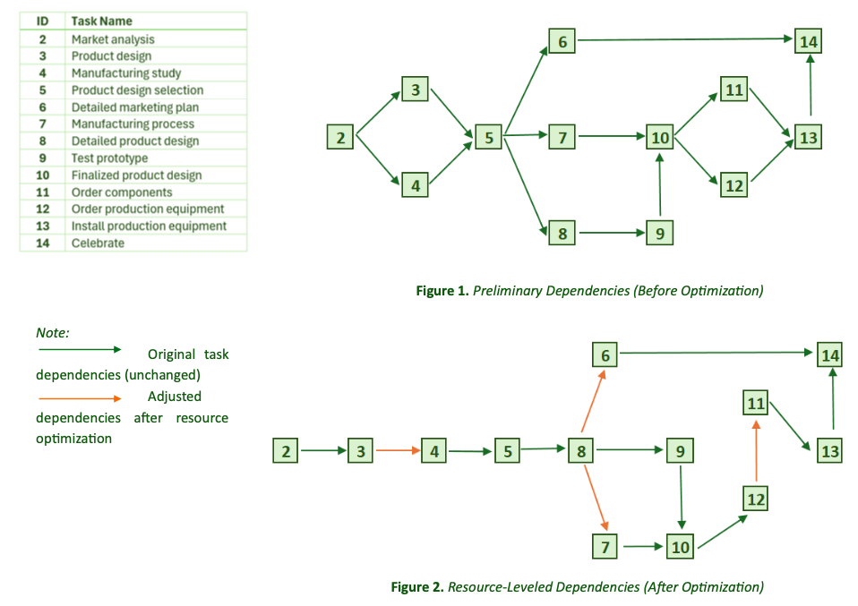

# Project Scheduling & Resource Optimization (Scooter Project)

> Individual case study focused on improving project timelines under resource constraints.

## Overview

This project looks at how a product launch can be delivered within a fixed deadline when resources are limited.

The goal was to understand whether the project could meet its timeline, and if not, how the plan could be improved.

## Problem Context

The project had **150 working days available**, but once resource constraints were considered, the schedule extended to **153 working days**, missing the deadline.

The main issue was not task duration, but the inability to run certain activities in parallel due to shared resources.

## Approach

- Identified the **critical path** and key dependencies  
- Analyzed where resource conflicts forced delays  
- Adjusted task sequencing to reduce bottlenecks  
- Compared different execution scenarios  
- Reviewed cash flow to improve cost distribution  

## Schedule Optimization

Several tasks originally planned in parallel had to be moved to sequential execution due to resource limits.

By restructuring dependencies and focusing on critical activities, the schedule was significantly improved.

## Key Results

- Reduced project duration from **153 → 128 working days**  
- Created a **1-month buffer** before the launch date  
- Found that most tasks were on the critical path, making the schedule highly sensitive to delays  
- Chose a solution that focused only on critical tasks, avoiding unnecessary effort  

## Insight

The biggest takeaway is that delays were caused more by **resource constraints and task dependencies** than by task duration itself.

Small changes in sequencing and prioritisation made a significant difference to the overall timeline.

## Impact

- Improved confidence in meeting the launch deadline  
- Reduced execution risk by focusing on critical tasks  
- Smoothed cost pressure by adjusting non-critical activities  
- Delivered a more realistic and manageable project plan  

## What This Project Shows

- Project scheduling under constraints  
- Critical path and dependency thinking  
- Practical decision-making  
- Turning analysis into a clearer execution plan  

## Files

- [Case Brief](./scooter-case-brief.pdf) — project scenario  
- [Full Analysis](./scooter-analysis.pdf) — detailed work and recommendations  
